### 231127
#### 플랫폼: 프로그래머스
#### 문제 이름 : 네트워크
#### 레벨 : 3
#### 사용 알고리즘 : DFS
#### [문제링크](https://school.programmers.co.kr/learn/courses/30/lessons/43162)

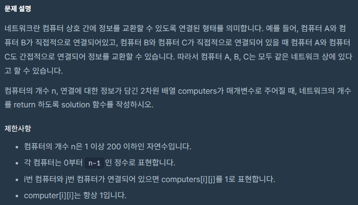
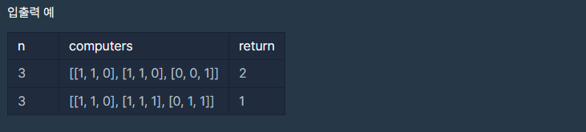
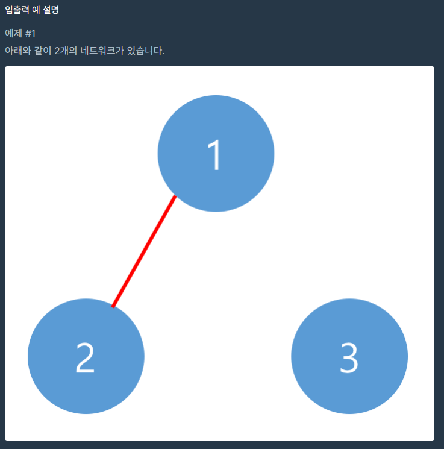
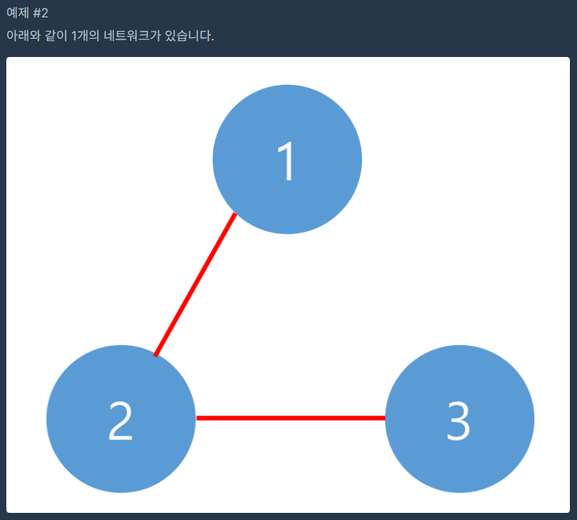

> 접근
 
1. 각자 연결 된 컴퓨터끼리 '1' 이라는 값으로 표기가 되어 있으므로 연결 노드간 관계를 가진다.
2. 연결 노드간 관계를 가지고 있으므로 DFS로 접근한다.
3. 지문을 보면 가운대 대각선은 모두 '1'이고, 가운데 대각선을 중심으로 우상 / 좌하 방향은 데칼코마니 방향이다.
4. 자기 자신과는 관계를 가지고 있으므로 항상 '1', (1.2)는 (2.1)과 1번 컴퓨터 ~ 2번 컴퓨터가 연결되어 있다는 의미이므로, 완벽한 대칭을 이룬다.
5. 완벽한 대칭을 이루므로 기존 방식처럼 반복을 두 번 수행하지 않고 컴퓨터의 갯수 만큼 만 반복한다.
6. dfs를 빠져나오려면 연결된 모든 컴퓨터를 방문하고 True 처리를 해 줘야 한다.

> 풀이
```python
def solution(n, computers):
    # 결과를 저장 할 값
    answer = 0
    
    # 컴퓨터의 갯수만큼 방문처리를 하기 위한 False 배열
    visited = [False] * n
    
    # dfs 탐색
    def dfs(x):
    
        # 인자로 받은 x번째 컴퓨터는 탐색을 진행 할 것이므로 True 처리
        visited[x] = True
        
        # 컴퓨터의 갯수만큼 반복을 돌면서 확인
        for i in range(n):
        
            # 만약 방문하지 않았으면서 관계가 맺어 졌을 경우에만
            if not visited[i] and computers[x][i] == 1:
                
                # 다음 탐색을 진행
                dfs(i)
    
    # 컴퓨터의 갯수만큼 반복을 돈다.            
    for i in range(n):
    
        # 만약 방문하지 않았 을 경우에만
        if not visited[i]:
        
            # dfs를 수행하고
            dfs(i)
            
            # 탐색이 완전히 끝난 경우 == 연결된 모든 컴퓨터들을 방문 했기 때문에 빠져나온 것
            answer += 1
                
    # 결과 return            
    return answer
```

---

### 231127
#### 플랫폼: 프로그래머스
#### 문제 이름 : 게임 맵 최단거리
#### 레벨 : 2
#### 사용 알고리즘 : BFS
#### [문제링크](https://school.programmers.co.kr/learn/courses/30/lessons/1844)

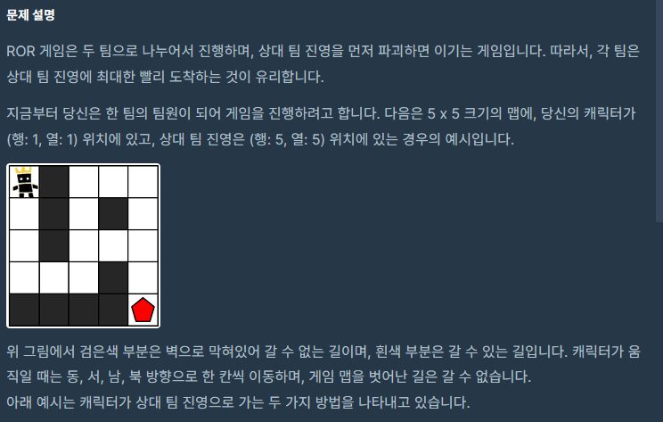

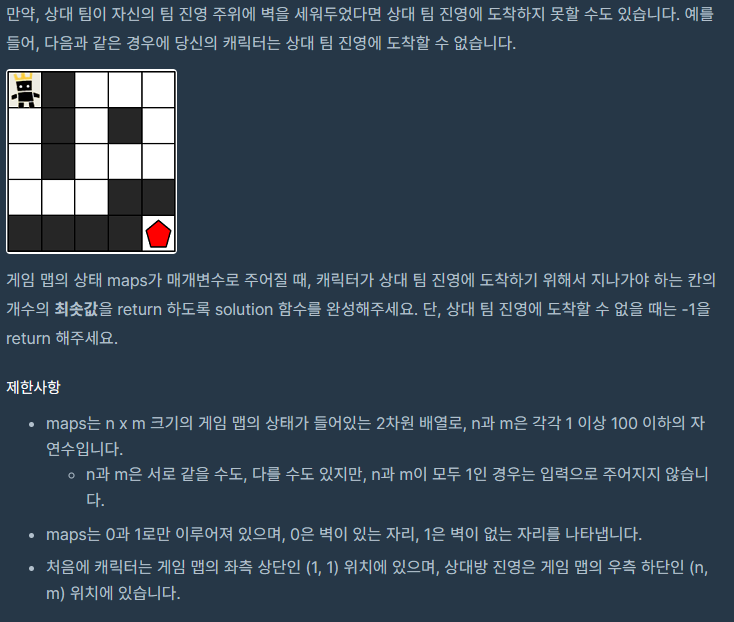
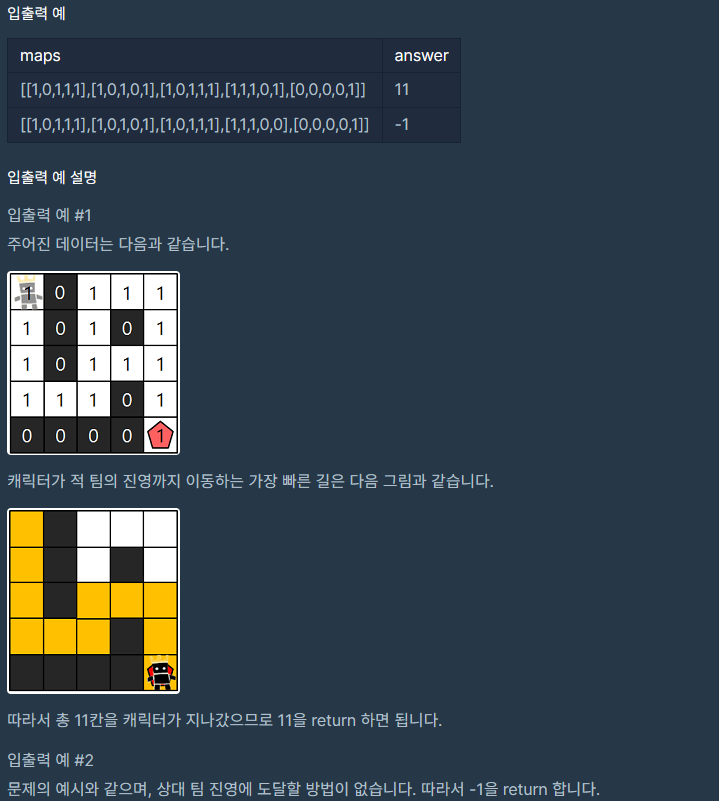

> 접근

1. 최단거리 문제이르모 BFS를 사용한다.
2. 방향을 따라 움직여야 하므로 방향을 선언한다.
3. 이동한 만큼의 거리를 측정한다.
4. 목표 지점의 좌표 값을 return 하면 된다.
5. 사방이 벽으로 막혀 도달 할 수 없는 경우 목표 좌표값은 항상 1이다.

> 풀이
```python
from collections import deque
def solution(maps):

    # 방향을 이동해야 하므로 상 / 하 / 좌 / 우 선언
    dx = [-1, 1, 0, 0]
    dy = [0, 0, -1, 1]
    
    # 게임 맵의 높이 n과 너비 m
    n = len(maps)
    m = len(maps[0])

    # 최단 거리를 구해야 하는 문제이므로 BFS 선언
    def bfs(x, y):
        
        # BFS이므로 queue를 선언하고
        queue = deque()
        
        # queue에 다음으로 이동 할 좌표를 넣는다.
        queue.append((x, y))

        # 이동 할 좌표가 없을 떄 까지 == 모든 경로를 탐색 했을 때 까지 반복
        while queue:
            
            # queue에서 다음으로 이동 할 위치를 꺼낸다.
            x, y = queue.popleft()

            # 상 / 하 / 좌 / 우 4분면 이동이므로 4번 반복한다.
            for i in range(4):
                
                # 다음 좌표를 정해준다.
                nx = x + dx[i]
                ny = y + dy[i]

                # 맵을 벗어나면 무시
                # 높이, 너비가 0을 넘어가거나 높이 / 너비를 넘어갔을 때
                if nx < 0 or nx >= n or ny < 0 or ny >= m:
                    continue

                # 벽이면 무시
                if maps[nx][ny] == 0:
                    continue

                # 처음 지나가는 길 일 경우에만
                if maps[nx][ny] == 1:
                    
                    # 거리를 한 칸 늘려준다.
                    maps[nx][ny] = maps[x][y] + 1
                    
                    # queue에 다음 좌표를 넣어준다.
                    queue.append((nx, ny))

    # bfs에 첫 시작 좌표를 넣고
    bfs(0, 0)
    
    # 가장 오른쪽 아래 도달지점의 값을 답으로 지정한다.
    answer = maps[n-1][m-1]
    
    # 만약 모두 벽에 막혀서 한 번도 못 간 길이라면 -1을 return
    return -1 if answer == 1 else answer
```

---

### 231128
#### 플랫폼: 프로그래머스
#### 문제 이름 : 섬 연결하기
#### 레벨 : 3
#### 사용 알고리즘 : Greedy
#### [문제링크](https://school.programmers.co.kr/learn/courses/30/lessons/42861)


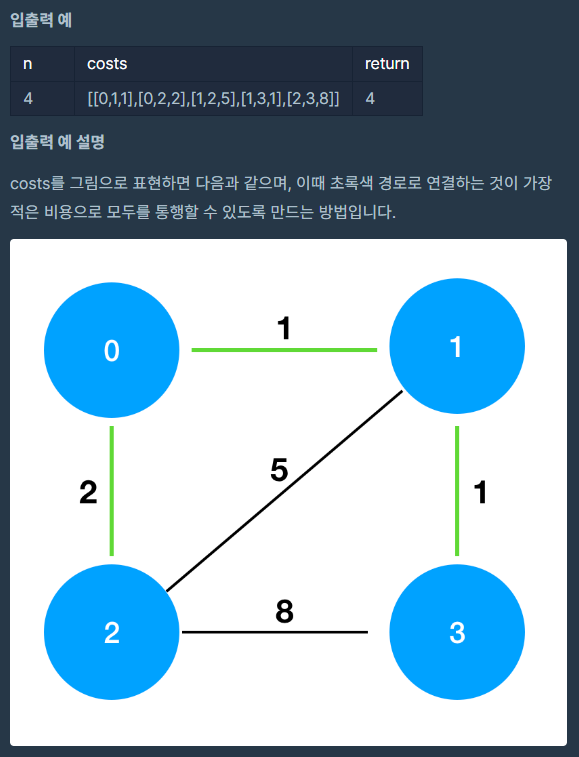

> 접근

1. 각 노드마다 연결되어 있어서 DFS나 BFS처럼 보이지만 Greedy로 푸는 것이 효과적이다.
2. Greedy 하게 접근하려면 어떤 조건이던 가장 작은 코스트를 고려해야 한다.
3. 따라서 주어진 배열에서 가장 작은 코스트를 기준으로 정렬한다.
4. 정렬 된 배열에서 서로 연결 된 섬의 정보를 알아낸다.
5. 지문에서 모든 섬은 연결되어 있다고 했으므로, 가장 작은 코스트 순서대로 가장 빨리 연결되는 순서대로 계산하면 된다. 

> 풀이
```python
def solution(n, costs):
    
    # 2차원 배열에서 마지막 값을 기준으로 정렬 == cost가 낮은 순으로 정렬
    costs.sort(key=lambda x:x[2])
    
    # set을 사용해 앞으로 입력하는 섬의 중복을 제거하고, 첫 시작점을 (0.0) 섬으로 설정
    visited = set([costs[0][0]])
    
    # 결과
    answer = 0
    
    # 섬은 총 n개 이므로 n개의 섬이 쌓일 때 까지 반복
    while len(visited) != n:
        
        # 주어진 배열을 돌면서
        for c in costs:
            
            # 만약 0 섬과 1섬이 이미 더 낮은 cost로 연결되었다면 무시한다.
            # sort를 통해 먼저 들어온 섬 들은 이미 더 낮은 가격에 들어 온 것이다.
            if c[0] in visited and c[1] in visited:
                continue
                
            # 만약 이어지지 않은 섬이 있다면    
            if c[0] in visited or c[1] in visited:
                
                # 방문 배열에 update 한다.
                # set으로 정의되었으므로 둘 중에 중복 된 한 가지 값은 처리되지 않는다.
                # 지문에 연결 할 수 없는 섬은 없다고 했으므로, 무조건 순차적으로 쌓인다.
                
                visited.update([c[0], c[1]])
                
                # 답안에 배열의 마지막인 cost를 추가한다.
                answer += c[2]
                
                # 하나의 행에 대해 섬을 추가했으므로 break를 통해 for문만 탈출한다.
                break
    
    return answer
```
---

### 231129
#### 플랫폼: 프로그래머스
#### 문제 이름 : 입국심사
#### 레벨 : 3
#### 사용 알고리즘 : Binary Search
#### [문제링크](https://school.programmers.co.kr/learn/courses/30/lessons/43238)

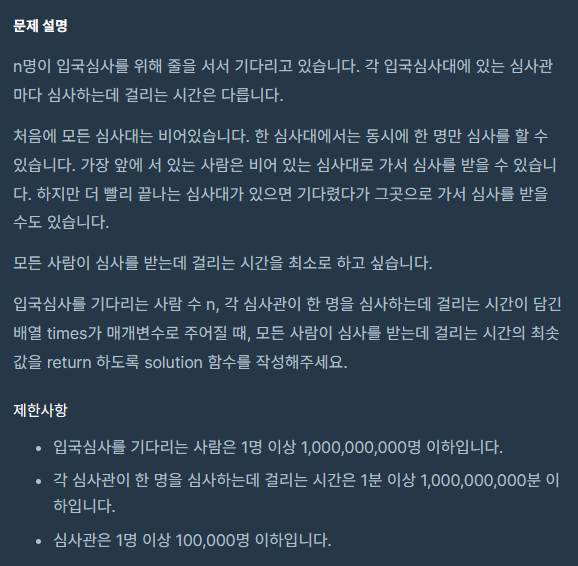
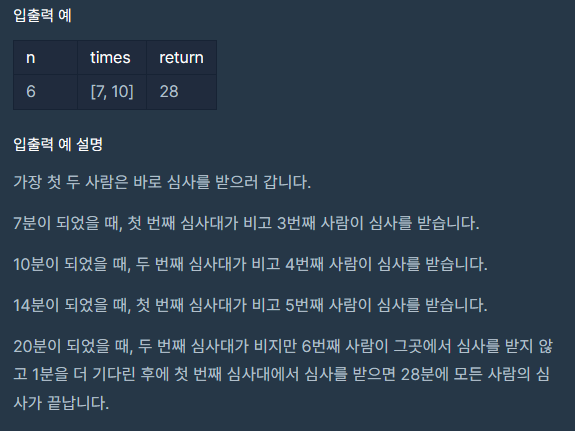

> 접근

1. 심사 시작 시간부터 가장 많은 사람을 가장 늦게까지 심사 할 수 있는 시간만큼 심사를 시작한다.
2. 주어진 시간들 중 적절한 시간을 골라 얼마나 많은 사람을 심사 할 수 있는지 확인해야 한다.
3. 매번 완전 탐색으로 적절한 시간을 골라 연산하는 것은 시간이 오래 걸리므로, 이진 탐색을 통해 범위를 줄여 나간다.

> 풀이
```python
def solution(n, times):
    
    # 가장 빨리 1명을 심사 할 수 있는 시간
    left = min(times)
    
    # 모든 사람을 가장 늦게 심사하는 시간
    right = max(times) * n
    
    # 결과
    answer = 0
    
    # 가운데 값에 수렴 하는 동안 계속 반복
    while left <= right:
        
        # 가운데 값은 첫 + 마지막 나누기 2
        mid = (left + right) // 2
        
        # 매 번 심사를 하는 사람 수
        result = 0
        
        # 주어진 시간을 돌면서
        for t in times:
            
            # mid만큼의 시간에 몇 명을 통과시킬 수 있는지 체크해서 심사 한 사람 수에 추가
            result += mid // t
            
            # 만약 한 번만에 결과를 찾는다면 더 이상 반복하지 않아도 됨
            if result >= n:
                break
        
        # 그런데 예상보다 많은 사람을 심사했다면 시간이 너무 넉넉하므로
        if result >= n:
            
            # 우선 부족하지 않게 심사를 해야 하기 때문에 답에 mid를 넣어주고
            answer = mid
            
            # 오른쪽 시간을 다 날린다.
            right = mid - 1
            
        # 예상보다 적은 사람을 심사했다면 시간이 부족하므로    
        elif result < n:
            
            # 심사 한 사람이 부족하니 답에는 넣지 않고 왼쪽만 날린다.
            left = mid + 1
            
    return answer
```

---

### 231130
#### 플랫폼: 프로그래머스
#### 문제 이름 : 이중우선순위큐
#### 레벨 : 3
#### 사용 알고리즘 : Heap
#### [문제링크](https://school.programmers.co.kr/learn/courses/30/lessons/42628)


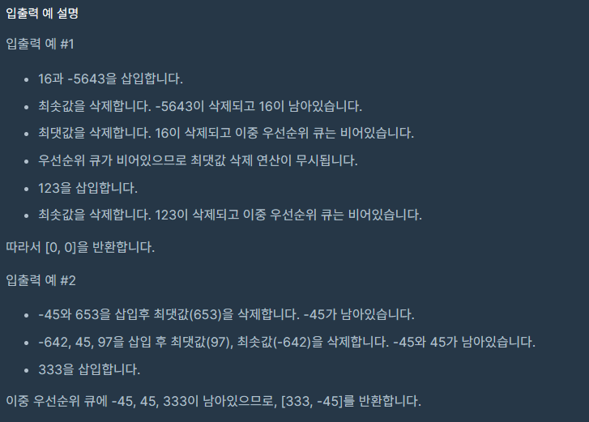

> 접근

1. 하나의 heap을 선언하고 주어진 operation을 돌면서 명령어가 Insert이면 heap에 하나씩 heappush 한다.
2. 파이썬에서의 heap은 최소힙이기 때문에 이를 인지한다.
3. 명령어가 Delete 이면서 heap에 추출 할 값이 있는 경우 명령어대로 값을 삭제한다.
4. max를 통해 가장 큰 값을, heappop을 통해 가장 작은 값 == heap의 최상위노드를 삭제한다.
5. heap에 남아있는 값이 없으면 [0, 0]을, 하나라도 남아있다면 heap의 최솟값과 최댓값을 찾아 결과 배열에 넣어 return 한다. 
> 풀이
```python
import heapq
def solution(operations):
    
    # 새로 만들면서 연산 할 heap의 빈 배열
    visited = []
    
    # 주어진 명령을 돌면서
    for operation in operations:
        
        # 명령어를 [명령, 숫자] 로 분리한다.
        o, num = operation.split()
        
        # num은 String이므로 다시 숫자로 바꾼다.
        num = int(num)
        
        # 만약 명령이 Insert 라면
        if o == 'I':
            
            # heap에 숫자부분을 넣는다.
            heapq.heappush(visited, num)
            
        # 만약 명령어가 Delete 이면서 숫자가 1이면    
        elif o == 'D' and num == 1:
            
            # 그리고 heap에 삭제 할 원소가 남아 있으면
            if len(visited) > 0:
                
                # heap에서 최댓값을 찾아 삭제한다.
                visited.remove(max(visited))
        
        # 두 개의 경우가 아니라면 == 명령어가 Delete이고 숫자가 -1이면
        else:
            # heap에 삭제 할 원소가 남아있으면
            if len(visited) > 0:
                
                # heap에서 최상단노드 == 최솟값을 삭제한다.
                heapq.heappop(visited)
        
    # heap에 값이 하나도 없으면 [0, 0]을, 하나라도 있으면 heap의 최대/최솟값을 retrun 한다.
    return [0, 0] if len(visited) == 0 else [max(visited), heapq.heappop(visited)]
```

---

### 231127
#### 플랫폼: 프로그래머스
#### 문제 이름 : 가장 큰 수
#### 레벨 : 2
#### 사용 알고리즘 : Greedy
#### [문제링크](https://school.programmers.co.kr/learn/courses/30/lessons/42746)

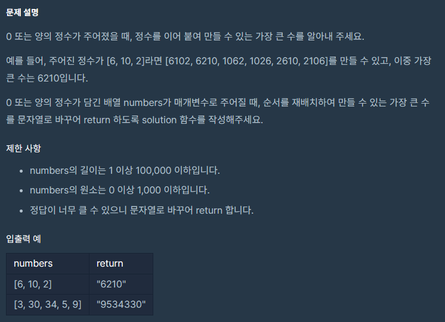

> 접근

1. 지문을 보면 각 숫자들의 자릿수와 상관 없이, 첫 번째 자리가 가장 큰 값대로 숫자를 이어 붙이는 것이 가장 큰 수가 된다.
2. 그러나 n번째 자리수가 같고 n + 1의 자리수가 다르면 더 큰 쪽이 우선순위를 가져야 한다.
3. 숫자에서 비교는 자리수 대로 정렬되는데, 문자열 비교는 각 문자를 숫자로 변환 한 값 대로 정렬되므로 문자열 배열로 정렬한다.
4. x에 3씩 곱해 문자열을 세 번씩 이어 준 이유는, 원소가 1000 이하이고 최대 길이는 100,000 이하이므로 3번씩 연이어 문자열을 붙여주면 문자열 비교가 가능하다. 
5. 정렬 문제이지만 빠른 해답을 찾는 Greedy에 가까워 보인다.
> 풀이
```pyton
def solution(numbers):

    # 아스키 코드 정렬을 위해 배열을 문자열로 다시 만든다.
    numbers = list(map(str, numbers))
    
    # 문자를 세 번씩 곱해 늘려 붙여 비교하고, 오름차순 정렬한다.
    numbers.sort(key=lambda x:x*3, reverse=True)
    
    # 그대로 문자로 뽑아주는데 str으로 변환하지 않으면 00 등의 값을 0으로 바꿀 수 없다.
    return str(int(''.join(numbers)))
``` 
```python
def solution(citations):
    citations.sort(reverse=True) 
    
    for c in range(len(citations)):
        if(citations[c] < c + 1):
            return c
    
    return len(citations)
    
```
