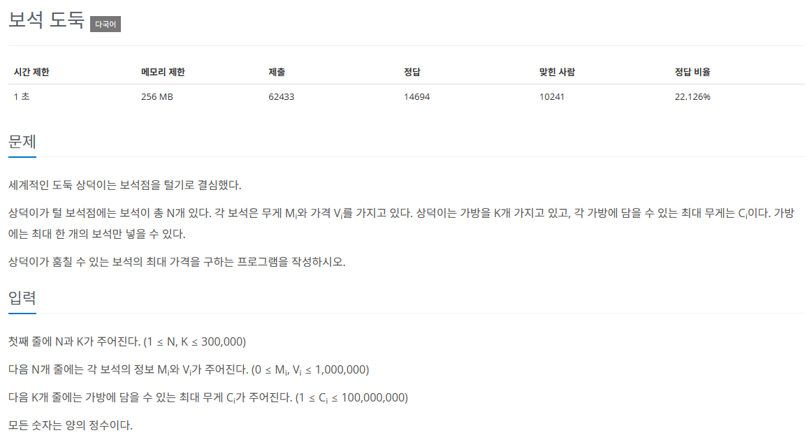
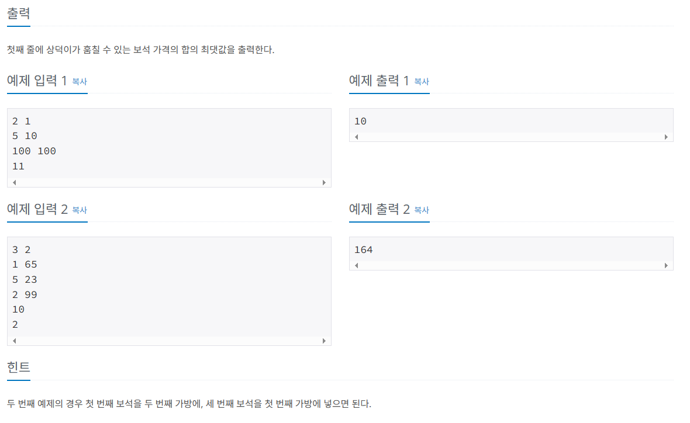

#### 플랫폼: 백준
#### 문제 이름 : 보석도둑
#### 레벨 : N/A
#### 사용 알고리즘 : Greedy
#### [문제링크](https://www.acmicpc.net/problem/1202)




> 접근
 
1. 가방에는 무조건 한 개의 보석만 들어가므로, 용량이 큰 가방에 작은 보석을 채우면 손해이다.
2. 용량이 작은 가방부터 채운다.
3. 용량이 작은 가방부터 채우지만 보석 또한 용량이 큰 것 부터 담아지면 담아지지 않으므로 손해이다.
4. 따라서 보석도 용량이 작은 것 부터 채운다.
5. 입력 받은 가방과 보석을 둘 다 가장 작은 수 부터 정렬하고 차례대로 담는다.
6. 모든 가방에 보석을 다 채우면, 채워진 보석의 값을 다 더한다.
7. 일반 배열로 풀면 시간초과가 나므로 heap을 사용해 O(LogN)의 시간 복잡도를 보장해야 한다. 

> 풀이
```python
import sys # 그냥 입력 받는 것 보다 sys를 통해 입력 받는게 빠르다던데 잘 모르겠음..
import heapq # heap을 사용하는 이유는 일반 배열보다 순회가 빠르다고 하는데 잘 모르겠음..

input = sys.stdin.readline

# 입력 받은 n, k를 저장 해 놓고 >> 2, 1
n, k = map(int, input().split())

# 보석 무게와 가격을 2차원 배열에 저장 해 둔다. >> [[5, 10], [100, 100]]
gems = [[*map(int, input().split())] for _ in range(n)]

# 가방 목록도 돌아가면서 확인 할 것이기 때문에 배열에 넣어둔다.
bags = [int(input()) for _ in range(k)] # [11]

# 가장 적은 무게의 보석부터 가방에 하나씩 채우는게 가장 많이 담을 수 있음 == 가장 비싼 가방이 됨

gems.sort() # 적은 무게 순으로 정렬
bags.sort() # 가방 또한 작은 것 부터 정렬
result = 0 # 결과 +=
visited = [] # 담은 보석 list

# 가방을 돌면서 보석을 담을 것임
for bag in bags:
    
    # 1. 보석을 하나씩 꺼내서 담고 없앨 것임
    # 2. 보석의 무게가 지금 가방 무게보다 작거나 같아야 담을 수 있음
    while gems and gems[0][0] <= bag:
        
        # visited를 heap으로 만들어서 음수로 보석 값을 저장한다.
        # 내장 된 기본 heap이 최소힙이기 때문에 음수로 만들어서 넣고 나중에 양수로 만들어 뺄 것임
        heapq.heappush(visited, -gems[0][1])
        
        # 보석을 썼으니 삭제한다.
        heapq.heappop(gems)
    
    # if문이 없으면 런타임 에러가 난다.. 보석이 하나도 안 담길 수 가 있는 듯
    if visited:    
        # 결과에 값을 더해 줄 때 음수로 저장된걸 양수로 변경해서 더해준다.
        result += -(heapq.heappop(visited))
        
print(result)
```
